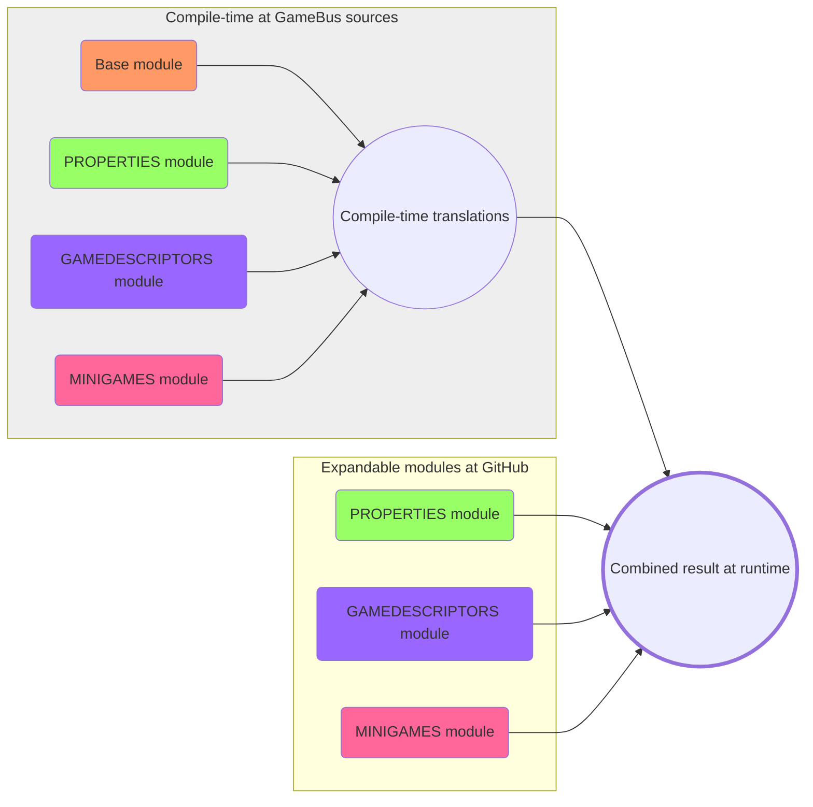

# gamebus-localization
This repository provides localization expansions for GameBus application.

GameDescriptors, Minigames and Properties are dynamic collections that are growing at runtime as a result of contributions from core team and external developers (minigames).

To make it work we have designed this way of managing localization strings.

Localizations consist of a base and expandable modules.

Base module contains strings for base app UI, for example: button captions etc.

Expandable modules provide localization strings for the growing collection of game descriptors and etc.

## Expandable modules
There are several modules that are expected to expand with time:
- GAMEDESCRIPTORS
- PROPERTIES
- MINIGAMES

Check corresponding folders for localization  files.

## Merge scheme
Localizations managed by core team are sitting in Front-End repo and are shipped with the app.

But the localizations added during the lifetime of application (external developer contributions, for example) are loaded dynamically at the runtime from GitHub CDN.

See the scheme of localization modules merge operation:

## Published with GitHub Pages
The files are served by GitHub CDN at https://vitalithree.github.io/gamebus-localization

For example:
- https://vitalithree.github.io/gamebus-localization/GAMEDESCRIPTORS/en.json
- https://vitalithree.github.io/gamebus-localization/PROPERTIES/en.json
- https://vitalithree.github.io/gamebus-localization/MINIGAMES/en.json

> More info about GitHub Pages: https://pages.github.com/

## How do i add translations for my MiniGame at GameBus?
Open a pull request to the `main` branch of this repository.

GameBus team will review it asap.

> More info about pull requests https://docs.github.com/en/pull-requests/collaborating-with-pull-requests/proposing-changes-to-your-work-with-pull-requests/creating-a-pull-request-from-a-fork

